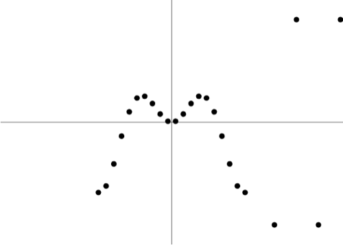
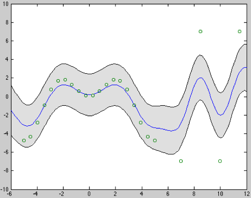
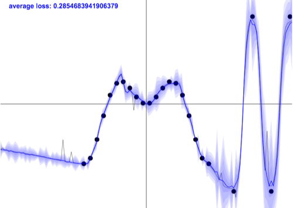
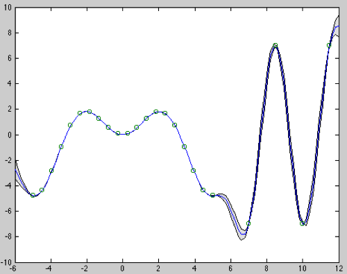

During a talk I gave at Google recently, I was asked about a peculiar behaviour of the uncertainty estimates we get from dropout networks (studied [here](http://mlg.eng.cam.ac.uk/yarin/blog_3d801aa532c1ce.html)). When fitting a model on the following dataset:

we observe the following weird behaviour:

... the model cannot increase its uncertainty to cover the points at the far right-hand side of the plane. The explanation to this behaviour is actually quite simple. To understand what's going on, we need to talk about [homoscedasticity](https://en.wikipedia.org/wiki/Homoscedasticity) versus [heteroscedasticity](https://en.wikipedia.org/wiki/Heteroscedasticity).

## Homoscedastic and Heteroscedastic Models

Homoscedastic regression assumes identical observation noise for every input point x. Heteroscedastic regression, on the other hand, assumes that observation noise can vary with input x. Heteroscedastic models are useful in cases where parts of the observation space might have higher noise levels than others.

*Example of a heteroscedastic model*

Using dropout we get **homoscedastic** model uncertainty. This can be seen from the model definition [[Gal and Ghahramani 2015, equation 8]](http://arxiv.org/abs/1506.02157). The likelihood in our derivations is defined as $y_i \sim N(muW(x_i), \tau-1 I)$ with $muW$ the network output, dependent on the randomly dropped weights $W$. Here our model precision $\tau$ (which is the same as the inverse observation noise) is a constant, which has to be tuned for the data.

We can easily adapt the model to obtain data-dependent noise. This simply involves making $\tau$ into a function of the data, very much like $\muW$ being a function of the data. We can tie the two functions together, splitting the top layer of a network between predictive mean $\mu(x)$ and predictive variance $\tau-1(x)$ (of course we would want to re-parametrise this to make sure $\tau$ is positive). Thus the new (now heteroscedastic!) model likelihood is given by $y_i \sim N(muW(x_i), **\tau-1,W(x_i)** I)$.

We can implement this new model by slightly adapting the cost function of the original model (I'll put a paper online with the derivations if there's interest). In the mean time you can browse through the code for this new cost function (named HeteroscedasticRegressionLayer in [my implementation into ConvnetJS](convnetjs/convnet_heteroscedastic.js)). We estimate our predictive variance like before by averaging stochastic forward passes through the model, both for $\mu$ and for $\tau$ (we made the observation noise parameter $\tau$ explicit, but there are other sources of uncertainty in our model; we will see an example below). 

## Examples

I put together a few interactive demos, demonstrating the differences between the homoscedastic model and the heteroscedastic one.

First, homoscedastic models with fixed observation noise (either large or small) cannot increase model uncertainty when the amount of observed noise increases rapidly (as we see on the right-hand side of the plane in the different figures). In [this interactive example](http://htmlpreview.github.io/?https://github.com/yaringal/HeteroscedasticDropoutUncertainty/blob/master/demos/homoscedastic_dropout_reg_large_observation_noise.html) we have a large(-ish) observation noise of $\tau=1$, and as we can see:

our model uncertainty does not increase at the right-hand side of the plane. This behaviour is shared with the Gaussian process (which this model approximates), as can be seen here:

Decreasing our (still) fixed observation noise to zero we can see that the model will try to fit through all points (and indeed overfit if left to run for enough time). We still see that the model is uncertain about parts of the space, demonstrating nicely that the observation noise is not the only factor in determining model confidence:

Again, we see the same behaviour with the Gaussian process:

This interactive dropout demo is given [here](http://htmlpreview.github.io/?https://github.com/yaringal/HeteroscedasticDropoutUncertainty/blob/master/demos/homoscedastic_dropout_reg_small_observation_noise.html). The Matlab code for the Gaussian process experiments is available [here](homoscedastic_GP_reg.m), with a dependency on [GPML](http://www.gaussianprocess.org/gpml/code/matlab/doc/).

Lastly, our new heteroscedastic model is demonstrated [here](http://htmlpreview.github.io/?https://github.com/yaringal/HeteroscedasticDropoutUncertainty/blob/master/demos/heteroscedastic_dropout_reg.html). This model manages to increase model uncertainty in the parts of the plane where there is higher noise:

You can play with this interactive [demo](http://htmlpreview.github.io/?https://github.com/yaringal/HeteroscedasticDropoutUncertainty/blob/master/demos/heteroscedastic_dropout_reg.html) and add more points to the dataset. Further examples with a different function ($y = x + sin(\alpha(x + w)) + sin(\beta(x + w)) + w$ with $w \sim N(0, 0.032), \alpha = 4, \beta = 13$, used in [Deep Exploration via Bootstrapped DQN](http://arxiv.org/pdf/1602.04621v1.pdf)) are given for:
* A homoscedastic model with [ReLU units](http://htmlpreview.github.io/?https://github.com/yaringal/HeteroscedasticDropoutUncertainty/blob/master/demos/homoscedastic_dropout_reg_DM_relu.html),
* A homoscedastic model with [TanH units](http://htmlpreview.github.io/?https://github.com/yaringal/HeteroscedasticDropoutUncertainty/blob/master/demos/homoscedastic_dropout_reg_DM_tanh.html) (inducing different uncertainty estimates),
* And a [heteroscedastic model](http://htmlpreview.github.io/?https://github.com/yaringal/HeteroscedasticDropoutUncertainty/blob/master/demos/heteroscedastic_dropout_reg_DM.html).

These demos demonstrate the differences between homoscedastic and heteroscedastic regression with dropout uncertainty. [ConvnetJS](http://cs.stanford.edu/people/karpathy/convnetjs/) was used here as a framework to interactively demonstrate the properties underlying dropout uncertainty. ConvnetJS was originally developed by Karpathy under the MIT license which is used here as well. 

